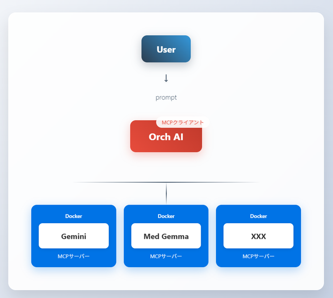

# 🏥 Medical-Multi-Agent（MMA）



医療用のマルチエージェントシステムです。（デモ版）
MCPクライアントにユーザーからプロンプトで指示を出すことで、Dockerコンテナ上のMCPサーバーを呼び出し、推論を行い、その結果をMCPクライアントが要約し出力します。
MCPクライアントの構造はかなり単純であるため、より深いAI同士の議論には、コードの改良やプロンプトの最適化が必要となってきます。
今後も少しずつ改良を進めていけたらと思います。

## ✨ 主な特徴

- **複数のLLMサーバー**: Gemini, MedGemmaなど、複数のLLMサーバーをサポートしています。
- **コンテナベース**: Docker Composeを使用して、各サーバーを簡単に起動・管理できます。
- **品質保証**: `pytest`によるテスト、`flake8`と`pre-commit`によるコード品質チェックの仕組みを備えています。（ローカルでの実行を想定）

## 🚀 セットアップ

1.  **リポジトリをクローンします:**
    ```bash
    git clone xxx
    cd xxx
    ```

2.  **Pythonの依存関係をインストールします:**
    ```bash
    pip install -r requirements.txt
    ```

3.  **pre-commitフックをインストールします:**
    ```bash
    pre-commit install
    ```

## ▶️ 実行方法

### サーバーの起動

Docker Composeを使用して、すべてのLLMサーバーを起動します。

```bash
docker-compose up -d --build
```

### クライアントの実行

（ここにクライアントの実行方法を記述します。例: `check_single_mcp.py`）

```bash
python src/check_single_mcp.py
```

```bash
python src/check_multi_mcp.py
```

## ✅ テスト

`pytest`を使用してテストを実行します。

```bash
pytest
```
