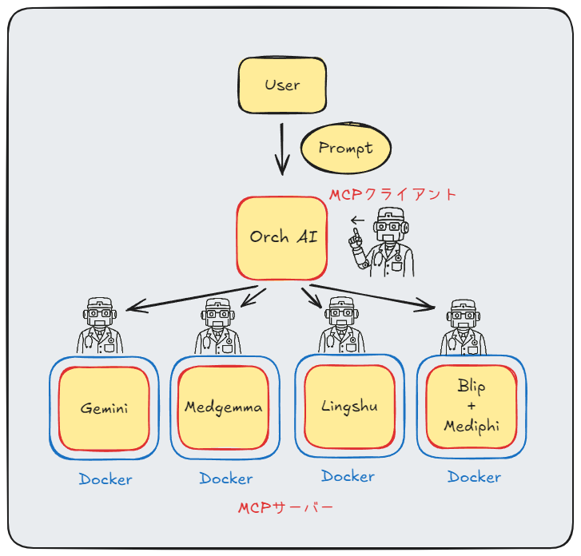

# 🏥 Medical-Multi-Agent（MMA）



医療用のマルチエージェントシステムです。（デモ版）
MCPクライアントにユーザーからプロンプトで指示を出すことで、Dockerコンテナ上のMCPサーバーを呼び出し、推論を行い、その結果をMCPクライアントが要約し出力します。
MCPクライアントの構造はかなり単純であるため、より深いAI同士の議論には、コードの改良やプロンプトの最適化が必要となってきます。
今後も少しずつ改良を進めていけたらと思います。

現状では、MedGemma（4bit量子化）とLingshu（4bit量子化）をRTX4070（12GB）で並列実行するとメモリ不足で自動的にCPU実行になりタイムアウトになる場合があります。
GPUの調子が良いときには並列で推論できますが、PCの画面がカクカクになる可能性があります。また、MCPサーバーが推論途中にタイムアウトした場合にはコンテナの再起動が必要となります。（改善する予定です。）

**※コンテナ間のモデルはvolumeで共有しています。そのため、volumeを作成し、その中にhugginfaceからダウンロードしたモデルを格納する必要があります。しかし、Geminiコンテナであれば、無料枠のAPIで利用できるのとvolumeが必要ないため、手っ取り早く試したい方はGeminiコンテナがおすすめです。**
Docker volume作成の参考URL：https://qiita.com/kompiro/items/7474b2ca6efeeb0df80f

## ✨ 主な特徴

- **複数のLLMサーバー**: Gemini, MedGemma, Lingshuなど、複数のLLMサーバーをサポートしています。
- **コンテナベース**: Docker Composeを使用して、各サーバーを簡単に起動・管理できます。
- **品質保証**: `pytest`によるテスト、`flake8`と`pre-commit`によるコード品質チェックの仕組みを備えています。（ローカルでの実行を想定）

## 🚀 セットアップ

1.  **リポジトリをクローンします:**
    ```bash
    git clone https://github.com/morikazu1119/Medical-Multi-Agent.git
    cd Medical-Multi-Agent
    ```
2.  **key.envの作成**

    以下のコマンドでenvファイル作成後に`GEMINI_API_KEY="your_api_key"`を記載してください。
    ```bash
    touch key.env
    ```

4.  **Pythonの依存関係をインストールします:**
    ```bash
    python -m venv .venv
    source .venv/bin/activate
    pip install -r requirements.txt
    ```

5.  **pre-commitフックをインストールします:**
    ```bash
    pre-commit install
    ```

## ▶️ 実行方法

### サーバーの起動

Docker Composeを使用して、すべてのLLMサーバーを起動します。

```bash
docker-compose up -d --build
```

### クライアントの実行

こちらはスクリプト内で実行するMCPのURLを1つ決めてください
```bash
python src/check_single_mcp.py
```

こちらは`src/config/config.yaml`の`mcp_url`に配列でURLを指定してください。
```bash
python src/check_multi_mcp.py
```

## ✅ テスト

`pytest`を使用してテストを実行します。

```bash
pytest
```
